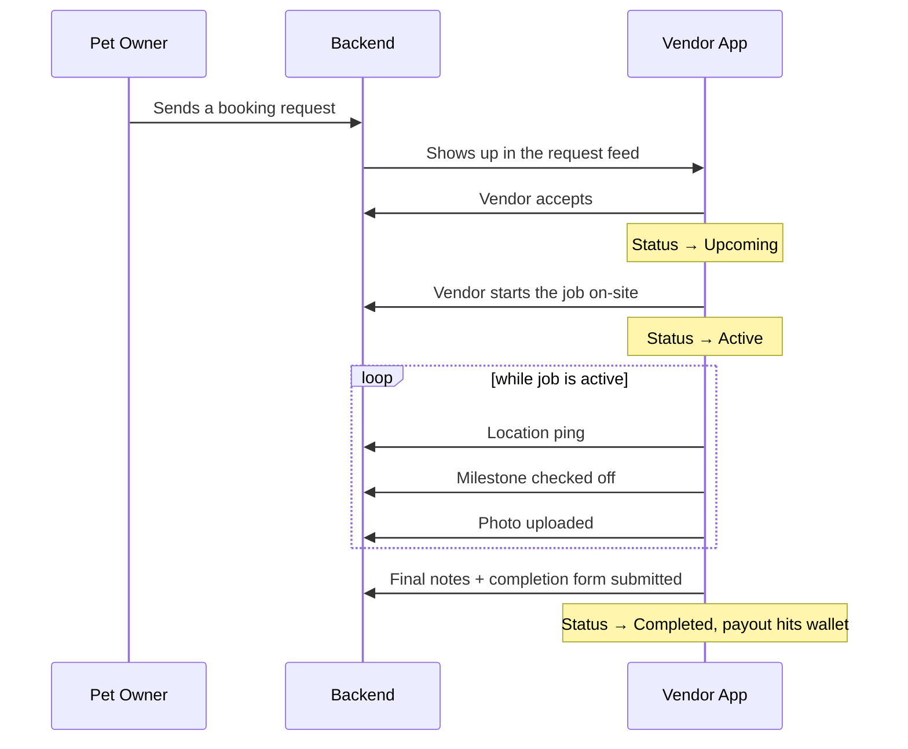

<div align="center">


<a href="https://github.com/mzaidiii/Pawffy-Vendor">
  
</a>

<br/>


<br/><br/>


</div>

<br/>

## 🐾 What is this

Pawffy has two sides to it — the app pet owners use to book a walk, a grooming session, or a vet visit, and the app the **service providers** use to actually run their business on top of it. This repo is the second one.

Pawffy Vendor is where groomers, vets, walkers, and trainers set up their profile, list what they offer, get discovered, accept jobs, and take a client's booking all the way from *"request received"* to *"paid out"* — with live location sharing while a job is active, milestone checklists, photo proof of work, and a chat thread with the client the whole way through.

It talks to a Node.js API gateway, with Supabase handling phone-based auth and a PostgreSQL database sitting underneath it all.

<br/>

## ✨ Core capabilities

<table>
<tr>
<td width="50%" valign="top">

**🔐 Phone-first onboarding**
OTP login via Supabase, then a guided multi-step setup — business info, service menu with pricing, weekly availability, license upload, and a review-and-submit step before an admin verifies the account.

**📥 Live request feed**
Incoming bookings land in a feed the vendor can accept or reject in real time, with search and status filters (pending / upcoming / completed / canceled).

</td>
<td width="50%" valign="top">

**📍 Active job tracking**
Once a job starts, GPS coordinates stream to the server on an interval, milestones get checked off as work progresses, and photos are attached along the way — right up to a final completion form.

**💬 Built-in messaging & wallet**
A dedicated chat thread per client, plus a wallet view for balance, payout history, and withdrawal requests.

</td>
</tr>
</table>

<br/>

## 🧭 How a booking actually moves through the app



<br/>

## 🏗️ Under the hood

```
lib/
├── core/
│   ├── storage/        → secure token & session storage
│   ├── config/         → Supabase keys, env config
│   ├── networks/       → Dio client, interceptors, API constants
│   └── utils/          → GPS, image picking, device helpers
└── features/
    ├── auth/            → OTP login, signup, session gate
    ├── onboarding/       → business setup wizard
    ├── home/             → dashboard, presence toggle, stats
    ├── requests/         → job feed → active job → completion
    ├── calendar/         → working hours, blocked dates
    ├── message/          → chat threads
    ├── notification/     → alerts feed
    └── profile/          → portfolio, wallet, settings
```

State is handled with **Riverpod**, networking runs through **Dio** with JWT interceptors, and tokens live in **flutter_secure_storage** so a session survives an app restart without ever touching plaintext storage.

<br/>

## 🎨 Design notes

- Full light/dark theme support — cards, borders, and text all key off `Theme.of(context).brightness` rather than hardcoded colors.
- One consistent accent color across the whole app: **Pawffy Orange** `#E85D04`, used for every CTA, checkmark, and active state.
- Every form screen is scroll-safe and keyboard-aware (`resizeToAvoidBottomInset`), wrapped in `SafeArea`, with text that shrinks gracefully on smaller screens instead of wrapping badly.

<br/>

## 🚀 Running it locally

```bash
# clone it
git clone https://github.com/mzaidiii/Pawffy-Vendor.git
cd Pawffy-Vendor

# grab dependencies
flutter pub get

# run on your device/emulator of choice
flutter run
```

You'll need a `.env` (or equivalent config in `core/config`) with your Supabase project URL/anon key and the base URL of the backend API before auth will work end to end.

<br/>

## 🗺️ Where this is headed

- [ ] Push notifications for new job requests
- [ ] In-app earnings analytics / weekly summaries
- [ ] Offline-first request queue for spotty connectivity mid-job
- [ ] Multi-language support

<br/>

## 🤝 About this project

Built solo, end to end — Flutter frontend, UX flows, and API integration. Part of the larger **Pawffy** ecosystem alongside the customer-facing app.

<div align="center">
<br/>

<a href="https://www.linkedin.com/in/mohd-murtaza-zaidi-b18a5b294">
  
</a>
<a href="https://x.com/">
  
</a>

<br/><br/>


</div>