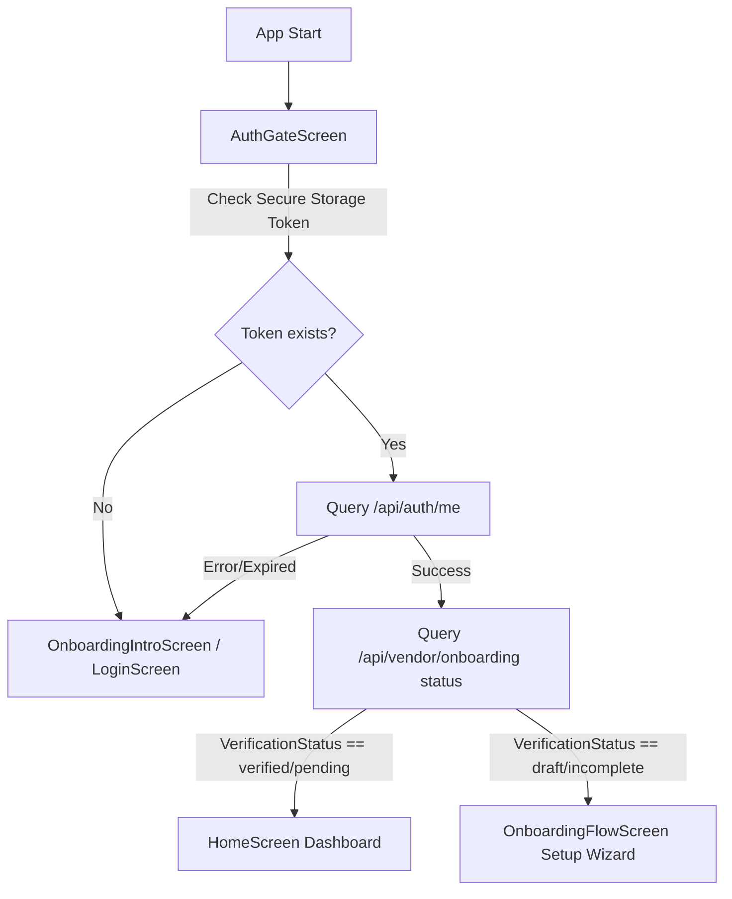
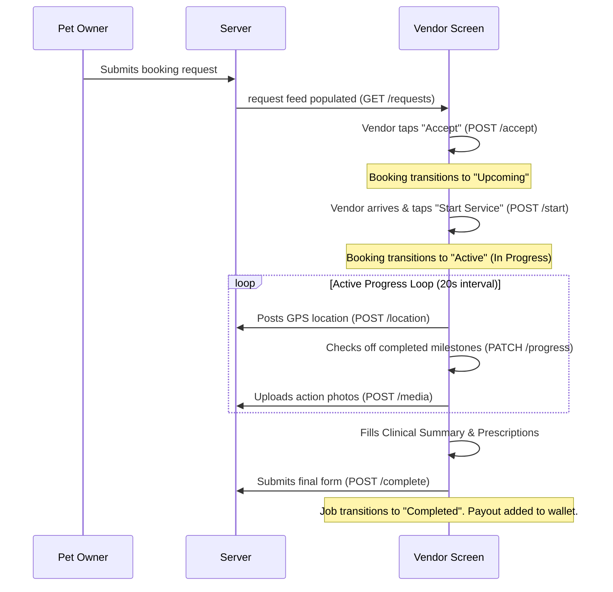

# 🐾 Pawffy Vendor (Provider) - Project Description & Flow Documentation

This document serves as the master guide for the **Pawffy Vendor (Provider)** mobile application. It maps the overall application flow, state transitions, layout constraints, theme compliance, and API integration paths from start to finish.

---

## 📋 Table of Contents
1. [🌟 Project Overview](#1-project-overview)
2. [🏗️ Tech Stack & Architecture](#2-tech-stack--architecture)
3. [🚀 End-to-End Application Flow](#3-end-to-end-application-flow)
4. [🌐 Comprehensive API Routing Map](#4-comprehensive-api-routing-map)
5. [🎨 UI/UX Theme & Responsiveness Rules](#5-uiux-theme--responsiveness-rules)
6. [🔧 Testing Checklist](#6-testing-checklist)

---

## 1. 🌟 Project Overview

**Pawffy Vendor** is a Flutter mobile application built for pet care providers (Groomers, Veterinarians, Dog Walkers, and Trainers). The application enables vendors to register their businesses, define custom service portfolios, establish standard availability, accept client requests, track real-time job progress (including active GPS tracking), message clients, manage payouts, and access service summaries.

It connects to a Node.js API gateway backend backed by a Supabase authentication layer and a PostgreSQL database.

---

## 2. 🏗️ Tech Stack & Architecture

- **Core Framework**: Flutter (Dart ^3.8.1)
- **State Management**: Flutter Riverpod (`flutter_riverpod` & `riverpod_annotation`)
- **Network Layer**: Dio client with standard header interceptors for JWT Bearer tokens
- **Persistence**: Flutter Secure Storage for tokens and session gating
- **Authentication Provider**: Supabase OTP SMS authentication
- **UI Components**: Custom themes leveraging Google Fonts (Barlow), adaptive animations, and dynamic Dark/Light themes.

```
📁 lib
 ├── 📁 core
 │    ├── 📁 Storage            # Secure local storage utility
 │    ├── 📁 config             # Supabase credentials & mock auth configs
 │    ├── 📁 networks           # Dio Client, constants, and logging interceptors
 │    └── 📁 utils              # GPS Location, Image Pickers, & Device utilities
 └── 📁 features
      ├── 📁 auth               # OTP Login, Signup, Session Gating
      ├── 📁 onboarding         # Multi-step Vendor Onboarding setup wizard
      ├── 📁 home               # Home Dashboard, Stats, Status capsules
      ├── 📁 requests           # Job feeds, Milestones, Active progress, completions
      ├── 📁 calendar           # Custom slot management & blocked dates
      ├── 📁 message            # Chat threads & direct messaging
      ├── 📁 notification       # App alert feeds
      └── 📁 profile            # Portfolio CRUD, Wallet, Settings & Help
```

---

## 3. 🚀 End-to-End Application Flow

### Flow 1: Initialization & Session Gating
When the app boots, the entry point redirects control to `AuthGateScreen`:



---

### Flow 2: Authentication (Sign-Up / Login)
Pawffy Vendor relies on phone number verification:
1. **Request Verification Code**:
   - Screen: `LoginScreen` or `CreateAccountScreen`.
   - Action: User enters mobile number. System triggers a Supabase OTP request (`Supabase.instance.client.auth.signInWithOtp`).
2. **Verify OTP Code**:
   - Screen: User inputs the 6-digit verification code.
   - Action: OTP is verified with Supabase (`auth.verifyOTP`). The client obtains a Supabase `accessToken`.
3. **Establish Backend Session**:
   - Service: The access token is exchanged via backend REST calls (`/api/auth/session` or `/api/auth/vendor/register`).
   - Outcome: The backend validates the Supabase session, generates a custom app Bearer JWT token, and passes it to the client. The client saves it using `StorageService.saveToken`.

---

### Flow 3: Multi-Step Onboarding Setup Wizard
Unverified vendors must complete a multi-step setup flow inside `OnboardingFlowScreen` before accessing the dashboard:

```
[Step 1: Business Info] ──> [Step 2: Services Setup] ──> [Step 3: Availability]
                                                                │
[Step 6: Pending Admin] <── [Step 5: Review & Submit] <── [Step 4: Doc Uploads]
```

- **Step 1 (Business Info)**: Inputs business name, contact name, phone, address description, and location details. Saves progress via `PUT /api/vendor/onboarding/business`.
- **Step 2 (Services Setup)**: Portfolio setup. Add services (groomer, vet, walker, trainer) with duration, price type (fixed or range), pricing, and inclusions. Triggers `POST /api/vendor/onboarding/services`.
- **Step 3 (Availability)**: Configure days of the week, working hours, and same-day preferences. Saves via `PUT /api/vendor/onboarding/availability`.
- **Step 4 (Doc Uploads)**: Interactively pick and upload a business license file (`multipart/form-data`) via `POST /api/vendor/onboarding/documents`.
- **Step 5 (Review & Submit)**: Summarizes all items via `/api/vendor/onboarding/review`. Clicking submit fires `/api/vendor/onboarding/submit`.
- **Step 6 (Pending Approval)**: Displays a locked screen informing the user their profile is under review. The app polls the dashboard periodically until the state becomes `verified`.

---

### Flow 4: Home Dashboard & Status Controls
Once verified, the vendor lands on `HomeScreen`:
- **Presence Toggle**: The vendor toggles their online/offline state using a header switch widget. When enabled, it updates status on the server (`PATCH /api/vendor/status`) so they can start receiving client requests.
- **Glance Metrics**: Displays dynamic cards summarizing today's active services, pending reviews, and current earnings.
- **Next Booking**: Renders upcoming bookings in a card feed.

---

### Flow 5: Requests & Milestone Tracking
This core flow tracks a booking from inception to payout:



---

### Flow 6: Messaging
Enables pet owners and vendors to communicate in real-time:
- **Conversation Feed**: Displays active chat threads, client avatars, last messages, and unread badge counts (`GET /api/vendor/chats`).
- **Chat Window**: Renders message histories sorted by timestamps (`GET /api/messages/:conversationId`).
- **Send Action**: Post text messages (`POST /api/messages`).

---

### Flow 7: Wallet & Account Settings
- **Wallet Screen**: Displays the vendor's total balance, pending payouts, and transaction history (`GET /api/wallet`).
- **Withdrawals**: Tapping withdraw sends a request with an amount and payout method (`POST /api/wallet/withdraw`).
- **Personal Details**: Modify location address, contact name, or profile descriptions directly (`PUT /api/vendor/profile`).
- **Change Settings**: Request email changes, phone changes, password resets, or adjust app notification rules.

---

## 4. 🌐 Comprehensive API Routing Map

Below is a detailed map of all backend REST endpoints consumed by the application, their repository classes, and requirements:

| Module / Action | File Reference / Service Class | API Endpoint Route | HTTP Method | Payload / Query / Header Details |
| :--- | :--- | :--- | :--- | :--- |
| **Login Session** | `AuthService` | `/api/auth/session` | `POST` | **Body**: `{"accessToken": "..."}` |
| **Register Partner** | `AuthService` | `/api/auth/vendor/register` | `POST` | **Body**: `{"accessToken": "...", "name": "...", "email": "...", "acceptTerms": bool}` |
| **Get Self Profile** | `AuthService` | `/api/auth/me` | `GET` | **Headers**: `Authorization: Bearer <token>` |
| **Log Out Session** | `AuthService` | `/api/auth/logout` | `POST` | **Headers**: `Authorization: Bearer <token>` |
| **Forgot Password** | `AuthService` | `/api/auth/forgot-password` | `POST` | **Body**: `{"email": "..."}` |
| **Change Password** | `AuthService` | `/api/auth/change-password` | `POST` | **Headers**: Bearer Token<br>**Body**: `{"currentPassword": "...", "newPassword": "..."}` |
| **Request Email Update**| `AuthService` | `/api/vendor/email/request-update`| `POST` | **Body**: `{"newEmail": "...", "password": "..."}` |
| **Verify Email Update** | `AuthService` | `/api/vendor/email/verify-update` | `POST` | **Body**: `{"newEmail": "...", "token": "..."}` |
| **Request Phone Update**| `AuthService` | `/api/vendor/phone/request-update`| `POST` | **Body**: `{"newPhone": "..."}` |
| **Verify Phone Update** | `AuthService` | `/api/vendor/phone/verify-update` | `POST` | **Body**: `{"newPhone": "...", "otp": "..."}` |
| **Get Onboarding State**| `OnboardingService` | `/api/vendor/onboarding` | `GET` | **Headers**: `Authorization: Bearer <token>` |
| **Put Business Info** | `OnboardingService` | `/api/vendor/onboarding/business`| `PUT` | **Body**: `{"businessName": "...", "contactName": "...", "phone": "...", "location": "...", "description": "..."}` |
| **Add Service** | `OnboardingService` | `/api/vendor/onboarding/services`| `POST` | **Body**: Service configuration details |
| **Update Service** | `OnboardingService` | `/api/vendor/onboarding/services/:id`| `PUT` | **Body**: Price and duration changes |
| **Delete Service** | `OnboardingService` | `/api/vendor/onboarding/services/:id`| `DELETE` | **Headers**: Bearer Token |
| **Put Availability** | `OnboardingService` | `/api/vendor/onboarding/availability`| `PUT` | **Body**: `{"workingDays": [...], "startTime": "...", "endTime": "...", "sameDayRequests": bool}` |
| **Upload Document** | `OnboardingService` | `/api/vendor/onboarding/documents`| `POST` | **Format**: `multipart/form-data`<br>**Fields**: `document` (File), `documentType` (String) |
| **Delete Document** | `OnboardingService` | `/api/vendor/onboarding/documents/:id`| `DELETE` | **Headers**: Bearer Token |
| **Get Setup Summary** | `OnboardingService` | `/api/vendor/onboarding/review` | `GET` | **Headers**: Bearer Token |
| **Submit Application** | `OnboardingService` | `/api/vendor/onboarding/submit` | `POST` | **Headers**: Bearer Token |
| **Get Home Dashboard** | `HomeService` | `/api/vendor/home` | `GET` | **Headers**: Bearer Token |
| **Patch Status** | `HomeService` | `/api/vendor/status` | `PATCH` | **Body**: `{"isOnline": bool}` |
| **Get Requests List** | `RequestsService` | `/api/vendor/requests` | `GET` | **Query**: `?status=pending` (or upcoming, completed, canceled), `&search=...` |
| **Accept Request** | `RequestsService` | `/api/vendor/requests/:id/accept`| `POST` | **Headers**: Bearer Token |
| **Reject Request** | `RequestsService` | `/api/vendor/requests/:id/reject`| `POST` | **Headers**: Bearer Token |
| **Start Job** | `RequestsService` | `/api/vendor/requests/:id/start` | `POST` | **Headers**: Bearer Token |
| **Patch Progress** | `RequestsService` | `/api/vendor/requests/:id/progress`| `PATCH` | **Body**: Checklist maps & outcome descriptions |
| **Upload Action Media** | `RequestsService` | `/api/vendor/requests/:id/media` | `POST` | **Format**: `multipart/form-data`<br>**Fields**: `media` (File) |
| **Stream Location** | `RequestsService` | `/api/vendor/requests/:id/location`| `POST` | **Body**: `{"latitude": float, "longitude": float, "address": string, "timestamp": string}` |
| **Complete Service** | `RequestsService` | `/api/vendor/requests/:id/complete`| `POST` | **Format**: `multipart/form-data`<br>**Fields**: prescription details, outcome notes, media |
| **Get Messages** | `MessageService` | `/api/messages/:conversationId` | `GET` | **Headers**: Bearer Token |
| **Get Chats List** | `MessageService` | `/api/vendor/chats` | `GET` | **Query**: `?search=...` |
| **Send Message** | `MessageService` | `/api/messages` | `POST` | **Body**: `{"receiverId": "...", "content": "..."}` |
| **Mark Chat Read** | `MessageService` | `/api/messages/:conversationId/read`| `PATCH` | **Headers**: Bearer Token |
| **Get Calendar Info** | `CalendarService` | `/api/vendor/calendar` | `GET` | **Query**: `?date=YYYY-MM-DD` |
| **Get Blocked Dates** | `CalendarService` | `/api/vendor/blocked-dates` | `GET` | **Headers**: Bearer Token |
| **Add Blocked Date** | `CalendarService` | `/api/vendor/blocked-dates` | `POST` | **Body**: `{"date": "YYYY-MM-DD", "reason": "..."}` |
| **Delete Blocked Date** | `CalendarService` | `/api/vendor/blocked-dates/:id` | `DELETE` | **Headers**: Bearer Token |
| **Get Standard Hours** | `CalendarService` | `/api/vendor/availability` | `GET` | **Headers**: Bearer Token |
| **Update Std Hours** | `CalendarService` | `/api/vendor/availability` | `PUT` | **Body**: `{"workingDays": [...], "startTime": "...", "endTime": "...", "sameDayRequests": bool}` |
| **Get Notifications** | `NotificationService`| `/api/notifications` | `GET` | **Query**: `?unread=true` |
| **Mark Notif Read** | `NotificationService`| `/api/notifications/:id/read` | `PATCH` | **Headers**: Bearer Token |
| **Mark All Notifs Read**| `NotificationService`| `/api/notifications/read-all` | `PATCH` | **Headers**: Bearer Token |
| **Delete Notification**| `NotificationService`| `/api/notifications/:id` | `DELETE` | **Headers**: Bearer Token |
| **Update Account Profile**| `ProfileService` | `/api/vendor/profile` | `PUT` | **Body**: `{"contactName": "...", "businessName": "...", "phone": "...", "location": "...", "city": "...", "state": "...", ...}` |
| **Upload Profile Avatar**| `ProfileService` | `/api/vendor/profile/avatar` | `POST` | **Format**: `multipart/form-data`<br>**Fields**: `avatar` (File) |
| **Get Preferences** | `ProfileService` | `/api/vendor/preferences/notifications`| `GET` | **Headers**: Bearer Token |
| **Put Preferences** | `ProfileService` | `/api/vendor/preferences/notifications`| `PUT` | **Body**: Notification toggle preferences |
| **Create Ticket** | `ProfileService` | `/api/support/tickets` | `POST` | **Body**: `{"subject": "...", "category": "...", "description": "..."}` |
| **Get Wallet Balance** | `ProfileService` | `/api/wallet` | `GET` | **Headers**: Bearer Token |
| **Withdraw Funds** | `ProfileService` | `/api/wallet/withdraw` | `POST` | **Body**: withdrawal values & bank info |

---

## 5. 🎨 UI/UX Theme & Responsiveness Rules

The design system incorporates rules to ensure aesthetic excellence and structural stability:

### 5.1 Light & Dark Mode Compliance
The system themes are configured in [main.dart](file:///c:/flutterdev/project/Pawffy%20Provider/pawffy/lib/main.dart).
- **Core Widgets**: Dashboard cards, lists, messages, settings options, calendar days, dialogs, and loaders automatically evaluate the current context brightness (`Theme.of(context).brightness`). They swap out light-grey borders and white cards for dark surfaces (`Color(0xFF1E1E1E)`) or card colors (`Color(0xFF232323)`), maintaining high legibility.
- **Dynamic Text Colors**: Headings, body copies, and descriptions utilize `Theme.of(context).colorScheme.onSurface` to change text colors automatically, avoiding visibility issues.
- **Orange Branding**: Key call-to-actions, checkmarks, selected elements, and button backgrounds always use Pawffy Orange (`#E85D04`) as the accent color.

### 5.2 Device Responsiveness & Overlaps
To adapt dynamically to screen size configurations and keyboard events, the UI uses the following practices:
- **No Overlapping Widgets**: Form inputs are wrapped in a `SingleChildScrollView`.
- **Keyboard Auto-Resizing**: Scaffolds utilize `resizeToAvoidBottomInset: true` (e.g. [LoginScreen](file:///c:/flutterdev/project/Pawffy%20Provider/pawffy/lib/features/auth/Login_Screen.dart)) to allow form fields to scroll when the soft keyboard is displayed.
- **Safe Area Insets**: Top status bars and bottom notches are wrapped inside `SafeArea` layouts to prevent rendering glitches on devices with status bar cutouts.
- **Fitted Text Scaling**: Headers and labels are wrapped inside a `FittedBox` using a `BoxFit.scaleDown` configuration to shrink text size on narrow viewports instead of breaking or wrapping onto multiple lines.

---

## 6. 🔧 Testing Checklist

Before deploying the app for production, verify these testing pathways:

1. **Authentication Flows**  
   - Enter a phone number, request an OTP code, sign in using code `123456` (Mock mode) or live SMS, and check session redirection.
2. **Onboarding Steps**  
   - Walk through the business setup, configure a service, save standard hours, select and upload a license document, submit the profile, and review the pending screen.
3. **Presence Toggle & GPS Updates**  
   - Toggle the online presence switch on the home dashboard. Start an active service booking and verify that coordinates are printed and streamed every 20 seconds.
4. **Milestone Checks & Media Uploads**  
   - Mark service checklist milestones as completed, capture and upload pictures from the device camera, and fill in clinical prescriptions.
5. **Theme Mappings**  
   - Toggle Light/Dark modes in settings and check that calendar grids, chats, dashboard cards, and wallet details adapt cleanly.
